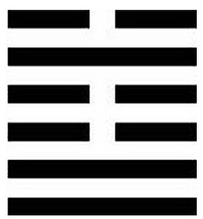

# 導言:
面對任何事情，都必須要有合理的節制，否則會產生很多不好的後遺症。節卦的初九爻和九二爻，代表人類的踝關節與膝關節，必須是陽剛的，不然無法直立行走，但是連續兩個陽爻，會導致剛性過強，顯得僵硬，所以馬上就加以節制，來兩個陰爻，分別代表人類的跨與腰，習武之人皆知跨要鬆，腰要柔軟，同時如果腰過於挺直，也會給人不禮貌與身段不柔軟的印象，兩個陽爻，馬上接兩個陰爻，這樣才能平衡，但是不會是三個陰爻，這樣陽氣就會輸給陰氣，所以背脊就是九五陽爻，武術決鬥的時候，如果躲不掉，背脊是硬的，可以用來幫忙格擋，緊接著來一個上六陰爻，代表人的脖子要軟，整個節卦就是提醒人們，該軟的時候要軟，該硬的時候要硬。
95明君，只要能因時因地制宜，不傷財不害民，即使被說專制，也要做下去，不能一昧的去討好老百姓，同時要注意，不能讓老百姓很聽話，但是官員貪污腐敗，或是老百姓很刁民，但是官員很守規矩，要拿捏兩者的平衡，政通人和，政府節制，每一個人都合理節制，才能把國家治理好。
忠孝節義，節佔了1/4，是非常重要的修養，不可因為自身有些錢，有些權勢，就開始恣意妄為，同理，各種意識形態，那怕是普世價值，也不可過度追求，首要的功課，就是要好好節制自己，修身養性。

<figcaption>節卦，上水下澤，在水庫還有水的時候，就要合理節制用水</figcaption>

# 卦辭:
## 節，亨。苦節不可貞。
萬事萬物如果調節的好，就不會偏枯，若工作、生活、學習、睡覺，都均衡，自然是亨通。但有附帶條件，苦節代表節制得太厲害，太過了，使大家苦不堪言，反而失去均衡狀態，偶爾實在沒有辦法的時候，可以讓大家辛苦一下，但是不可長久，苦節注定是不可貞的。過分刻苦，過分耐勞，過分不近情理的節制，不應該當成是常規。可見節制本身也有限度，不可過分強調。任何節制，都有最低限度，不能說最基本的生活資源，都不給百姓。苦節不可貞本身也有限制，當時機很不好的時候，領導站出來比人民還節制，過得比人民還要不好，這還是會亨通的，反過來就行不通了。

# 雜卦:
## 節，止也
節卦，節就是有限度，做任何事情不可以沒有限度，止就是節制，做事要整齊劃一，統一步調，節卦的意義實大於止，所以不叫做止卦，而是稱其為節卦。

# 彖曰:
## 節，亨，剛柔分，而剛得中。苦節不可貞，其道窮也。悅以行險，當位以節。中正以通，天地節而四時成，節以制度，不傷財，不害民。
適當的節制，被稱為甘節，能取得好的效果，過分的節制，被稱為苦節，導致人員流動性大，寧可逃，也不願在這裡受苦。節卦，下卦是兌卦，就是喜悅，上卦是坎險，只要人們知道節制對是對他們好的，不是剝削也不是壓迫，即使有一點點險阻，也很樂意配合。節制註定是有險阻的，當一個人舒服的日子過久了，突然被告知要節制，就會很不舒服，放長假以後也是難以收心。六四與九五當位，君王近臣，需要配合好，然後要考慮老百姓是否能接受。從大自然中，可以看到四季有節奏感，春夏秋冬，甚麼時候立冬，甚麼時候立春，明明白白，這樣老百姓才知道要如何適應，不可朝令夕改，原則變來變去，中正才能通達。要百姓悅以行險，原則上要做到不傷財不害民，才是好的制度。國家不可以沒有制度，要有典章制度，不然就是渙卦，就會渙散，但是要做到當行即行，當止則止，各有其度，這裡面學問很大，可以從大象中多加學習。
修養自身的品行，制數度以外要看重議德行，有形的制度以外，無形的德行要兩邊兼顧。這輩子無論富或窮，怎樣的日子都要能過，不能只會節制過苦日子，或只會過很好的日子。過年過節，不能只是吃喝玩樂。吃粽子，吃月餅的時候都有它的涵意，都要去理解，不能只是渙散的狀態，這樣就失去了節的意義。
節制若合理，就能長長久久，所謂政治，就是在節制跟渙散之間，取得平衡點，調節得宜的目的，就是要達到政通民和，僅此而已。人民是一盤散沙，政府政令若能通行無阻，就能把老百姓整合起來，同時，若老百姓都很樂意實踐，人與人之間都能和諧相處，政通人和，就是最了不起的成就。

# 大象:
## 澤上有水，節; 君子以制數度，議德行。
下面是澤(兌)，上面是水(坎)，水澤節，澤上面要有水，才能談到節約，要趁水庫有水的時候，就要想到要節約了。制數度就是量化的意思，要把最低限度與最高限度，標示得清清楚楚，要有明確的指標，也就是KPI或是警戒線，但是仍然不可完全量化，完全量化，會變成苦節不可貞。再者，能力或許可以量化，但是品德需要合議，任何標準都不可以偏道，不能只是一個人說得算，需要有Check and Balance 機制，避免整個標準偏掉。論語說，道之以政，齊之以刑，民免而無恥。道之以德，齊之以禮，有恥且格。不能只看到制數度，要有禮來節，不能只是不違法就好了，很多事情，雖然不違法，但是很不安心，若摸著良心，知恥，自然會有所節制。

# 初九:
## 不出戶庭，无咎。
## 不出戶庭，知通塞也。
政令要嚴守機密，不能走漏風聲，否則政令就會失效，在做任何調節，任何制度，在還沒有任何動作的時候，都不能明說，否則就是打草驚蛇，不可以讓人心更亂，這樣完全無法得到預期的目標，前功盡棄。

# 九二:
## 不出門庭，凶。
## 不出門庭凶，失時極也。
門庭已經在戶外，政令一旦實行，要公告周知，陽居陰位，很有可能不合時宜，所以要廣為宣導，避免老百姓不服。新加坡政府不分部門，只要是政府的命令，每個單位都要廣為宣導，不可以失時宜，宣導期間過了，就要開始逞罰。

# 六三:
## 不節若，則嗟若，无咎。
## 不節之嗟，又誰咎也。
若自身不節制，最後受罰了，自作自受，只能怪自己，這裡的無咎不一定是沒有後遺症的意思，有可能是無可歸咎。若是知道要節制，才能無咎。人有好色的本性，結婚即是一種節制，要尊重有婦之夫，有夫之婦，要節制，不然出事了，自作自受，又能怪誰?

# 六四:
## 安節，亨。
## 安節之亨，承上道也。
人民很安祥自然的接受新的政策，所有人都很樂意配合，就會亨通，反之，不遵守規定，都會變成刁民，64接近95君王，必須以身作則，節制給老百姓看，起到示範的作用。

# 九五:
## 甘節，吉。往有尚。
## 甘節之吉，居位中也。
64只要安然配合，95就會甘節，就會吉祥，陽居陽位，居中得位，掌握到合理點，老百姓會覺得很合理，值得所有百姓的崇尚與擁護，甘節的政治，連千秋萬世，子孫後代，都要稍作修改，照著來做。過年過節，如果吃多了，變胖了，這時候為了保持健康體態，就會樂於節制，如此一來就是甘節。

# 上六:
## 苦節，貞凶，悔亡。
## 苦節貞凶，其道窮也。
上六顯示節卦的極端，節制實踐的越徹底，越不近人情，就是苦節，導致各種憾事發生，極度凶險，由此可以來總結全卦，若是節制太寬，就會亂紀敗壞，若是節制太嚴，就會同歸於盡，這樣都不是辦法，如同高速公路必然有限速，有限速的地方必然有道理，有明確的牌子，而且要遵照，只要大家都會得合理，那就是甘節，但是，如果無論甚麼地方都限速30公里，那就太過分了，只能是苦節，沒有人想遵守。隨時都要存一點錢，有備無患，但是也不可鐵公雞，搞到過於苦節，這樣也沒有意思，節的合理，當省不用，當用不省。
政府執行政令，要保持誠信，避免老百姓過度懷疑，要老百姓節制，政府要廣施誠信，不然老百姓不會甘之如飴的遵守，這就是中孚卦要傳達的智慧，告訴我們怎樣才能廣施誠信，敬請期待，下回分解。
