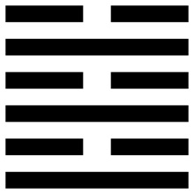

# 導言:
乾坤交疊，陰陽互動最密切的就是既濟卦與未濟卦，既濟代表成功，未濟代表失敗，而且未濟卦序緊接在既濟之後，象徵成功以後大概率會失敗，但不可看成是一定，宇宙萬物注定是可轉換的，是有機的。從既濟和未濟中互卦可以看得出來，若是既濟的成分大一點 (兩個既濟，一個未濟，坎卦離卦)，稱為既濟卦，若是未濟的成分大一點 (兩個未濟，一個既濟，坎卦離卦)，稱為未濟卦，既濟與未濟可以看成是不斷循環，既濟在未濟的前後，未濟也在既濟的前後。由於，局勢不斷演進，時間不斷流轉，是非成敗轉頭空，隨時都需要調整與檢討，沒有恆常不變的輸與贏，既濟與未濟的情節交互蹲跳，乃是自然之理。此外，既濟卦全部都是陰乘陽，代表小人都在欺凌君子，這到底是好事還是壞事呢? 對於君子來說，當然是好事，未經一番寒徹骨，沒有勞其筋骨，空乏其身，要如何能夠練出能夠成大事的意志? 對於小人來說，沒有人認為自己是小人，其實都是老天要小人來成全君子，所以小人才無理取鬧，才讓人難堪，才要測試君子有多大的能耐，於是就練就了君子。既濟卦，必須是一切都安渡才能稱為既濟，但隨即容易得意忘形，喪失防範，於是既濟又變成未濟，初吉終亂，福過災生了。

<figcaption>既濟卦，上水下火，紅火的成功裡面有撲滅的成分，順風順水的成功裡面也有容易著火搞砸的成分，火往上，水往下，水火不容，需要媒介來轉化，即是既濟</figcaption>

# 卦辭:
## 既濟，亨小，利貞。初吉終亂。
既濟可以看成是調整到和宇宙同步，完美的完成任務，取得成功，所謂亨小有兩個解釋，一個即是要連小的都亨，差一點點，都不太算是既濟，另一個解釋則是不能取大略小，看不見的往往比顯而易見的還要致命，顯而易見的往往早已經被定價，那些看不見的，不那麼顯而易見的，則是替未來提前埋下了伏筆，既濟維持不易，需要高度的警戒。於是，就大概率是，初吉終亂，成功往往會讓人鬆懈，然後變數的出現，往往會讓人措手不及。解決之道就是要利貞，要採取正當手段使這個成功的果實，能夠符合天道，能夠盡量合理，隨時都要做好必要的調整，這樣的話，才會真正的有利。

# 雜卦 / 序卦:
## 既濟，定也
## 有過物者必濟，故受之以既濟。
既濟能看成是船在水中，因為陰爻都在陽爻之上，船能乘載貨物也能乘載船員，只要能安全渡過，那成功已定，但若是乘載過重，吃水過多，反而會導致船容易進水，也容易沉沒，能不能成功渡過，中間仍然存在不少關鍵因素，例如天氣，礁岩，船員是否和睦等等，於是，只能說是即將渡過，即將成功，即是既濟。

# 彖曰:
## 既濟亨，小者亨也。利貞，剛柔正而位當也。初吉，柔得中也，終止則亂，其道窮也。
所有64卦裡面，只有既濟卦，每一爻都當位，初九六四，六二九五，九三上六，陰陽調和，剛柔並濟，皆相應，這樣的卦因為六二柔得中，必然能夠初吉，但由於上六無所往，又是陰爻，終會導致動亂，雖說窮則變，但沒有保證一定變則通，大部分的情形，在通之前，都會亂一陣子。上六處在邊界，在窮的時候，改變的力道太弱，於是便得到其道窮也的結論。既濟與未濟是相綜的，既濟的上六可以看成是對應到未濟的初六，如此一來，既濟與未濟可以看成是，會往復循環，生生不息的轉換過程。

# 大象:
## 水在火上，既濟，君子以思患而豫防之。
水火不容照理來說不會既濟，必然需要轉化的媒介，於是大象裡面說，君子時時刻刻居安思危，事先防範。努力去避免，因為處理不當而引發的禍患，提前就想好錦囊妙計，等到問題出現的時候，可以立刻的拿出來，很快就可以發揮效用。水火本是不容，要不是水把火澆熄了，就是火把水燒乾了，這告訴君子做任何事情，要事先進行沙盤推演，切莫大意，任何可能產生的副作用，都要提前設想去防止，或是做適當的調理轉化，只要事情一發生，就能立刻去處理，這樣才能叫做既濟。

# 初九:
## 曳其輪，濡其尾，无咎。
## 曳其輪，義无咎也。
初九是既濟卦的開始，叫做成功在望，理當很激進，同時六四與初九相應，新鮮人來到一間名聲很好的大公司，又有人拉拔自己，這時很難能夠不急躁。爻辭，反而告訴我們，這時反而要拖住車輪，要踩踩煞車，避免鋒芒畢露，做任何事情應該要遵循事緩則圓的大原則，新進人員，能力卓越，一炮而紅，容易變成所有人打擊的目標。於是就要濡其尾，注意自己的尾巴沾濕，這樣就等同被扯後腿，被穿小鞋。賽車在遙遙領先的時候，註定就是安穩跑到終點即可，無須再冒特別大的風險，避免功虧一簣。

# 六二:
## 婦喪其茀，勿逐，七日得。
## 七日得，以中道也。
婦女有首飾(茀)，有身分，有地位，和九五又相應，一個貴夫人，先生當了大官在外面，有兩個人就經常來騷擾她，初九與九三近水樓台先得月，容易輕薄貴夫人，這個時候九五身分尊貴，反而不要自己出面，不必去追逐任何改善目標，過一陣子，自然有人來加以制止，中道即是如此，宇宙無限完美對沖，中道自然會去對沖掉這種問題。

# 九三:
## 高宗伐鬼方，三年克之，小人勿用。
## 三年克之，憊也。
高宗是殷朝的一個帝王叫做武丁，鬼方就是貴州那些地方，當年還比較偏僻，離中原比較遠，雖看起來成功在望，但是已經征戰了三年，要完成克敵這件事情，元氣也大傷了，此時就是小人登場表演的時候，這些人在成功仍然遙遠的時候不會出現，一旦嗅到即將成功，就會想盡辦法，立刻跑來沾光。經過如此艱辛的艱難奮鬥，如同去攻打很遠的地方，自己也疲憊不堪了，難以辨別小人，小人都來沾光，此時已經默默種下許多隱患了。

# 六四:
## 繻有衣袽，終日戒。
## 終日戒，有所疑也。
無論是既濟還是未濟，都是船在水上走，隨時都有險阻，需要終日警戒，防範未然。繻有衣袽，即是破舊的衣服，隨時要在船上，把孔塞住，好好的來補漏，避免沈船。六四雖然是當位的，但是一陰處於兩陽之間，就像是有漏洞的船在航行一樣，隨時都在擔心，隨時都需要警惕。成功之路總是充滿了坎險，有許多假設性問題，都要終日戒，避免功虧一簣。

# 九五:
## 東鄰殺牛，不如西鄰之禴祭，實受其福。
## 東鄰殺牛，不如西鄰之時也，實受其福，吉大來也。
禴祭表示僅僅用薄禮來祭拜，而殺牛表示用很豐厚的祭品來祭天，東鄰則是指商紂王，西鄰指周文王，相對於商紂王財大氣粗，照道理本該是無法比擬的，但天神事實上只在乎你的誠意，不在乎你的厚薄，在乎你的精神面，是否善良，是否光明正大。時指時運，時運不同，心態也不同，一旦成功，祭品要豐厚了，儀式要隆重了，反而會吸引很多隱患，還不如照舊，保持本心與初心，如此吉祥才能長長久久，永遠都很興盛。心誠則靈，追求精神上的喜悅，而非是物質上面的顯擺。

# 上六:
## 濡其首，厲。
## 濡其首厲，何可久也。
慶功宴，喝酒，全身都是酒氣，一不小心就掉到水裡去了，頭都濕透了，上六在九五之上，已經超過了既濟，準備要進入未濟，全身都落到水中，未濟不是既濟的延續，從成功到衰敗能獲取經驗，從衰敗到成功也能獲取經驗，千萬不可以天真的以為，任何事情反正因果不斷循環往復，成功了會變失敗，失敗了會變成功，那就乾脆甚麼都不要去做。上六也在讓我們時刻警惕，成功了不要鋪張浪費，也不要自大，要持續虛心學習，如此一來才能長長久久。心理面始終有未濟的準備，就能不斷的去求進取，任何過度的進取，只會使得其他人要想辦法拖慢你的速度，要想辦法看你的笑話，於是就必須要審慎進取，就必須參考未濟卦的智慧，關於未濟卦的內容，容請，靜待下回分解，謝謝大家。
